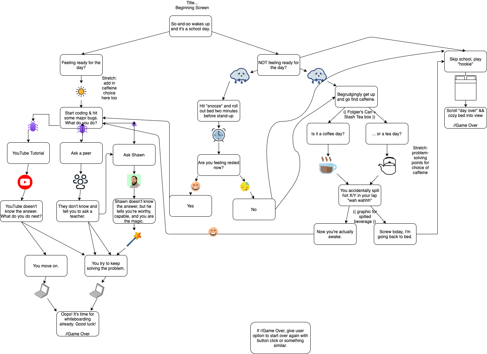

# Choose Your Own Adventure

## Three-day In-Class Assignment Working with React & Redux for Epicodus, Week 19

### By Patrick Osten, Garrett Dean Brown & Danielle Thompson

### Project began 3.1.21. Last updated 3.4.21.

---

### Get in Touch

| Name   | Contact Info                                                                                                                                            |
| --- | -------------------------------------------------------------------------------------------------------------------------------------------------- |
| danithompson74 at gmail.com   | [LinkedIn](https://www.linkedin.com/in/danielle-thompson74/)   |
| gman9mm at live.com   | [LinkedIn](https://www.linkedin.com/in/garrett-brown-d/)  |
| posten.coding at gmail.com   | [LinkedIn](https://www.linkedin.com/in/patrick-osten/)  |

### Known Bugs

_No known bugs at this time._

[Report bugs here.](https://github.com/dani-t-codes/choose-your-own-adventure/issues) | [Request features here.](https://github.com/dani-t-codes/choose-your-own-adventure/issues)

---

<!-- START doctoc generated TOC please keep comment here to allow auto update -->
<!-- DON'T EDIT THIS SECTION, INSTEAD RE-RUN doctoc TO UPDATE -->

- [Description](#description)
  - [MVP Objectives](#mvp-objectives)
  - [Shortened Storyline](#shortened-storyline)
- [User Stories](#user-stories)
- [Story Board Flow Charts](#story-board-flow-charts)
- [Stretch Goals](#stretch-goals)
- [Technologies Used](#technologies-used)
  - [Setup/Installation Requirements](#setupinstallation-requirements)
    - [Running the Project Locally](#running-the-project-locally)
      - [For Mac Users](#for-mac-users)
      - [For Windows Users](#for-windows-users)
      - [For Both Mac & Windows systems](#for-both-mac--windows-systems)
    - [Available Scripts](#available-scripts)
      - [`npm start`](#npm-start)
      - [`npm test`](#npm-test)
      - [`npm run build`](#npm-run-build)
      - [`npm run eject`](#npm-run-eject)
  - [Additional Resources](#additional-resources)
  - [Legal, or License](#legal-or-license)

<!-- END doctoc generated TOC please keep comment here to allow auto update -->

## Description

This choose-your-own-adventure application walks you through the various choices an Epicodus faces during any given day of class.

### MVP Objectives

- #ILoveBlob #BlobLife.

- React.js front-end with a focus on animations & parallax scrolling with React-Spring
- Hard-code back-end responses (prompts/choices)
- Stretch goal: refactoring hard-coded responses, etc. with C# as back-end
- Make sure that we systemize how hard coding, etc happens. (CRUD??)
  Start by setting up front end ...

- with state(gameStarted: true/false, prompt, choices, turn(?))
  --> React only, no Redux.

Things that are repeatable:

- Form to make choices
- Prompts
- Parallax scroll with repeatable background/images

### Shortened Storyline

Splash Page & Intro --> Billboard wakes up --> feeling ready for the day (sunrise png) --> starts coding but bugs (bugs) --> ask Shawn (Shawn avatar) --> you are the magic (magic images) --> keep trying to solve the problem (laptop) --> oops its whiteboarding (end day)

---

## User Stories

| #   | Stories                                                                                                                 |
| --- | ------------------------------------------------------------------------------------------------------------------------|
| 1   | A user should be able to pull the pink button.  |
| 2   | A user should be able to move the blue blob.    |
| 3   | A user should be able to click the "Day in the Life" header away, and click it back into view. |
| 4   | A user should be able to scroll through the parallax components and see new images and storyline info come into view.   |
| 5   | A user should be able to click the round buttons to scroll to the next story segment.    |

---

## Story Board Flow Charts

## Stretch Goals

- Take in a user's name with an input box to plug into the story line.
- Find a way to add in a choose your own adventure element to the prompts and images that come into view - perhaps with multiple parallax pages per storyline or maybe using ternary conditionals to toggle between views.
- Find a way to refactor the GameControl page & parallax to not be so dang wieldy.

## Technologies Used

- [Homebrew](https://brew.sh/)
- [VS Code](https://code.visualstudio.com/download)
- Git & GitHub
- ES6 JavaScript
- JSX
- React Framework v17.0
- React-Spring v8.0
- React-DOM v.17.0.1
- React Bootstrap v1.5.0
- @react-spring/addons v.9.0.0-beta.33
- react-use-gesture
- hooks: `useState()`, `useSpring()`, `useGesture()`, `useTrail()`, `useDrag()`
- `create-react-app`
- `npm install --save-exact react-scripts@3.2.0`
- `npm install react-spring`
- webpack v5.11.1
- Babel
- ESLint
- npm
- node.js v15.8.0
- [Unsplash](unsplash.com)

---

### Setup/Installation Requirements

- To access the live page visit ... TODO

#### Running the Project Locally

###### For Mac Users

- Access Terminal in your Finder, and open a new window.
- Install the package manager in the Terminal, [Homebrew](https://brew.sh/), on your device by entering this line of code:
`$ /usr/bin/ruby -e "$(curl -fsSL https://raw.githubusercontent.com/Homebrew/install/master/install)"`.
- Once homebrew is installed, install Git, a version control system for code writers, with this line of code: `brew install git`.
- Now, install Node.js through Homebrew with the following command: `brew install node`.
- Confirm that node and npm (Node's package manager that is automatically installed alongside Node) are on your working system with two command lines `node -v` & `npm -v`, respectively returning something resembling `v14.5.0` & `6.14.5` (or higher).

###### For Windows Users

- Open a new Command Prompt window by typing "Cmd" in your computer's search bar.
- Determine whether you have 32-bit or 64-bit Windows by following these [instructions](https://support.microsoft.com/en-us/help/13443/windows-which-version-am-i-running).
- Go to [Git Bash](https://gitforwindows.org/), click on the "Download" button, and download the corresponding exe file from the Git for Windows site.
- Follow the instructions in the set up menu.
- Go to the [Node.js website](https://nodejs.org/en/download/) and download the appropriate source code for your Windows operating system.

###### Cloning the Project

- Go to this [GitHub repository](https://github.com/dani-t-codes/choose-your-own-adventure) and click the green 'Code' button.
- Clone this application with the following command:`git clone https://github.com/dani-t-codes/choose-your-own-adventure.git`.
- (Optional) If you would like to save your own copy to your GitHub account, click the "Fork" button in the upper right hand corner of the main repository page.
- Open the project in the code editing application of your choice like VS Code.

##### Available Scripts

In the project directory, you can run:

###### `npm start`

Runs the app in the development mode.\
Open [http://localhost:3000](http://localhost:3000) to view it in the browser.

The page will reload if you make edits.\
You will also see any lint errors in the console.

###### `npm test`

Launches the test runner in the interactive watch mode.\

###### `npm run build`

Builds the app for production to the `build` folder.\
It correctly bundles React in production mode and optimizes the build for the best performance.

###### `npm run eject`

**Note: this is a one-way operation. Once you `eject`, you can’t go back!**

---

#### Additional Resources

- [Building a Create-Your-Own Adventure Game using Rails and React!](https://medium.com/@kiyanadunlock/building-a-create-your-own-adventure-game-using-rails-and-react-fbfeff906787)
- [Building a “Choose Your Own Adventure”-Style Game Engine in 48 Hours](https://www.viget.com/articles/building-a-choose-your-own-adventure-style-game-engine-in-48-hours/)

#### Legal, or License

This software is licensed under the [MIT License](https://choosealicense.com/licenses/mit/).

Copyright (c) 2021 _*Patrick Osten, Garrett Dean Brown & Danielle Thompson*_

